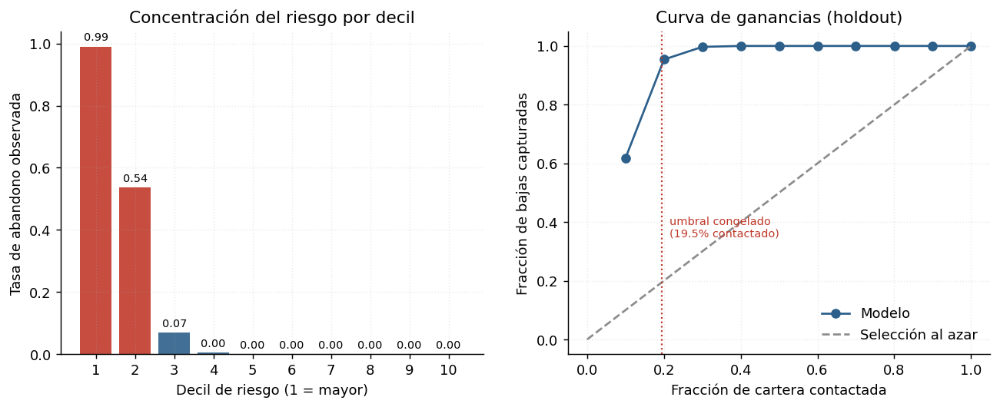
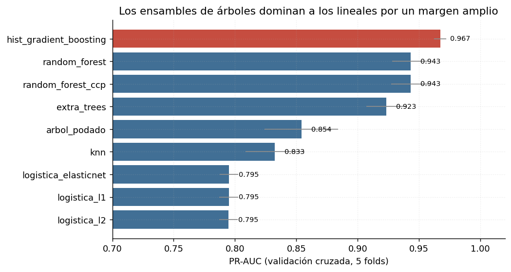
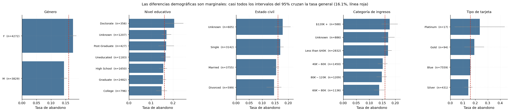
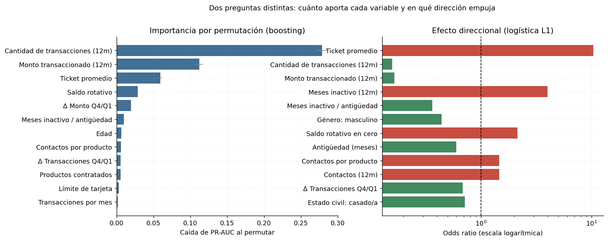

# Predicción de abandono de clientes en banca minorista

Modelo de propensión al abandono (*churn*) sobre una cartera de 10.127 clientes
de tarjeta de crédito, con una política de priorización de campañas de
retención derivada del modelo.

El proyecto no termina en una métrica: termina en una decisión operativa —a
quién contactar, con qué criterio y a qué costo— y en un análisis explícito de
qué sostienen los datos y qué no.

---

## Resultado

Sobre el conjunto de holdout, evaluado **una sola vez** con modelo y umbral
congelados:

| Métrica | Valor |
|---|---|
| ROC-AUC | 0,992 |
| PR-AUC | 0,965 |
| Brier score | 0,023 |
| Precisión (al umbral congelado) | 0,778 |
| Recall | 0,948 |
| F1 | 0,854 |
| Cartera contactada | 19,5% |

El modelo captura el **94,8% de las bajas contactando al 19,5% de la cartera**.
El primer decil de riesgo concentra el 61,9% de las bajas, con un lift de 6,2
sobre la selección al azar.



---

## Sobre la magnitud de estos resultados

Un ROC-AUC de 0,99 no es normal y no debe leerse como mérito del modelo. Se
auditó antes de reportarlo:

- cero filas duplicadas dentro de cada partición;
- cero solapamiento entre `train` y `test`;
- ninguna variable separa por sí sola (el mejor AUC univariado es 0,796, para
  cantidad de transacciones);
- el preprocesamiento va dentro del pipeline, así que no hay fuga por escalado.

No hay leakage. El dataset —*Credit Card Customers*, publicado en Kaggle— es
sintético o fuertemente depurado, y resulta casi separable para ensambles de
árboles. Sobre datos bancarios reales, con clases del orden del 2% y ruido de
medición, un resultado de esta magnitud sería motivo para buscar el error antes
que para celebrar. Se reporta con esa advertencia, no sin ella.

---

## Decisiones metodológicas

### El modelo produce una probabilidad; la política produce una decisión

Son dos objetos distintos y se eligen con criterios distintos. El modelo se
selecciona por métricas independientes del umbral (PR-AUC). El umbral se fija
después, con un criterio de negocio explícito.

Se compararon cuatro criterios, todos calibrados sobre predicciones **fuera de
muestra**:

| Criterio | Umbral | Cartera contactada | Precisión | Recall | Costo |
|---|---|---|---|---|---|
| F1 máximo | 0,330 | 16,4% | 0,900 | 0,919 | 12.595 |
| Capacidad (techo 30%) | 0,014 | 30,0% | 0,533 | 0,995 | 17.740 |
| **Costo mínimo** | **0,104** | **20,0%** | **0,782** | **0,972** | **8.880** |
| Convención 0,5 | 0,500 | 15,1% | 0,929 | 0,874 | 17.705 |

Contactar al 30% en vez del 20% gana 2,2 puntos de recall y duplica el costo.
La capacidad del equipo de retención es un **techo**, no un objetivo: agotarla
sólo porque existe multiplica los falsos positivos sin ganar casi nada. El
umbral congelado usa el criterio de costo, configurable en
`src/config.py:THRESHOLD_POLICY`.

Los costos (100 por cliente perdido, 15 por contacto innecesario) son supuestos
ilustrativos: lo que importa es su relación, no la magnitud. Cualquier
implementación real debe reemplazarlos por cifras propias.

### Protocolo experimental

1. `churn_train.csv` (8.101 filas) se usa para todo el desarrollo.
2. Nueve candidatos evaluados con validación cruzada estratificada de 5 folds,
   optimizando PR-AUC.
3. El umbral se calibra con `cross_val_predict` sobre train, nunca sobre el
   holdout.
4. `churn_test.csv` (2.026 filas) se evalúa una sola vez, al final.

El paso 3 importa: un umbral optimizado sobre el mismo conjunto donde después
se reporta performance es un hiperparámetro ajustado al test.

### Por qué PR-AUC y no accuracy

Con 16% de positivos, predecir "nadie se va" acierta el 84% de las veces y no
identifica un solo cliente en riesgo. La línea base de PR-AUC es la prevalencia
(0,16); la de ROC-AUC es 0,5 sin importar el desbalance, lo que la hace parecer
más favorable de lo que es.

### Tratamiento del desbalance

Se usa `class_weight="balanced"` —reponderación de la clase minoritaria dentro
de la función de pérdida— en vez de remuestreo sintético (SMOTE, ADASYN). Con
16% de positivos y 8.100 filas, la clase rara no es tan rara como para
necesitar ejemplos artificiales, y reponderar no distorsiona la distribución
conjunta de las variables. El desbalance se maneja en el umbral, no cambiando
los datos.

---

## Modelos evaluados



| Modelo | PR-AUC (CV) | Rol |
|---|---|---|
| Hist Gradient Boosting | **0,967** | Boosting por histogramas |
| Random Forest | 0,943 | Bagging, complejidad por profundidad |
| Random Forest con poda ccp | 0,943 | Bagging, complejidad por poda posterior |
| Extra Trees | 0,923 | Cortes aleatorios |
| Árbol con poda de coste-complejidad | 0,854 | Reglas legibles |
| KNN | 0,833 | No paramétrico |
| Logística elastic net | 0,795 | Regularización mixta |
| Logística L1 | 0,795 | Selección de variables |
| Logística L2 | 0,795 | Baseline interpretable |

La brecha de 17 puntos entre boosting y logística indica que el poder
predictivo está en las **interacciones**: ninguna correlación bivariada con el
target supera 0,4 en valor absoluto.

Las tres logísticas empatan hasta la tercera decimal, lo que significa que la
regularización no hace trabajo: con 24 predictores y 8.100 observaciones no hay
sobreajuste que corregir.

---

## Resultados negativos

Se reportan porque son parte del análisis, no a pesar de serlo.

**Las variables derivadas no aportan nada.** Se construyeron seis variables de
intensidad transaccional siguiendo la lógica RFM de la literatura de churn
bancario. La ablación da PR-AUC 0,9679 **sin** ellas y 0,9678 **con** ellas. El
boosting reconstruye los ratios mediante cortes sucesivos en sus componentes;
el feature engineering ayuda cuando el modelo no puede expresar la
transformación por sí mismo, que es el caso de los lineales, no el de los
ensambles de árboles. Se conservan porque mejoran la interpretabilidad de la
logística.

**La demografía no separa.** De 23 categorías en cinco variables demográficas,
sólo cuatro tienen intervalos de confianza del 95% que excluyen la tasa general
de abandono, y por márgenes pequeños. El género es distinguible (17,5% vs
14,4%) porque los grupos son grandes, no porque la diferencia lo sea; en la
importancia por permutación no entra entre las diez primeras variables. Una
diferencia puede ser estadísticamente distinguible y a la vez inútil para
ordenar clientes por riesgo.



**La segmentación es débil.** El silhouette máximo es 0,185 en K=2. Los grupos
se solapan considerablemente. Con datos de comportamiento esto es esperable —no
hay tipos discretos de cliente, hay un continuo— pero significa que la
segmentación describe una tendencia, no una partición nítida.

---

## Interpretabilidad



Dos preguntas distintas, dos herramientas distintas:

- **Cuánto aporta cada variable**: importancia por permutación, calculada fuera
  de muestra. Se prefiere al `feature_importances_` de los árboles, que se
  calcula en entrenamiento y sobrevalora las variables de alta cardinalidad.
- **En qué dirección empuja**: odds ratios de la logística L1.

Los odds ratios **requieren un modelo logístico**. Exponenciar el coeficiente
de una regresión lineal ajustada sobre un target 0/1 no produce un odds ratio,
produce un número sin interpretación. `src/interpret.py` levanta un `TypeError`
si se le pasa un estimador que no tiene coeficientes logísticos.

Las variables dominantes son transaccionales: cantidad de transacciones,
monto transaccionado y ticket promedio concentran la importancia. Meses de
inactividad y contactos con el banco empujan al alza; antigüedad y cantidad de
productos contratados protegen.

---

## Segmentación de la cohorte priorizada

El clustering no compite con el modelo: lo complementa. El modelo dice *quién*
tiene riesgo alto; el clustering pregunta si dentro de ese grupo hay perfiles
que justifiquen acciones distintas. Se aplica sólo dentro de la cohorte
priorizada, con reducción de dimensión por PCA previa a k-means.

| | Segmento 0 | Segmento 1 |
|---|---|---|
| Clientes | 79 (20%) | 317 (80%) |
| Tasa de abandono | 0,80 | 0,77 |
| Transacciones anuales | 69 | 41 |
| Monto anual | 7.502 | 2.178 |
| Ticket promedio | 109 | 53 |
| Límite de tarjeta | 14.518 | 6.879 |
| Δ transacciones Q4/Q1 | 0,80 | 0,51 |

Las tasas de abandono son casi idénticas: **los segmentos no se diferencian en
riesgo, se diferencian en valor**. Esa es su utilidad. El modelo ya ordenó por
riesgo; el clustering agrega la dimensión que falta para decidir cuánto
invertir en retener a cada cliente.

El segmento 0 justifica contacto humano y ofertas individuales. El segmento 1,
cuatro veces más numeroso y con un tercio del monto por cliente, no paga el
costo de contacto individual: corresponden acciones automatizadas.

---

## Estructura

```
├── data/
│   ├── raw/                   churn_train.csv, churn_test.csv
│   └── processed/             scoring_holdout.csv (salida del pipeline)
├── src/
│   ├── config.py              rutas, semillas, esquema, política de decisión
│   ├── data.py                carga y validación estructural
│   ├── features.py            variables derivadas y preprocesador
│   ├── models.py              catálogo de modelos y grillas
│   ├── evaluate.py            métricas, umbrales, deciles y lift
│   ├── interpret.py           odds ratios, permutación, dependencia parcial
│   └── segment.py             clustering de la cohorte de alto riesgo
├── scripts/
│   ├── run_pipeline.py        pipeline completo, de los CSV a los resultados
│   ├── make_figures.py        figuras del informe
│   └── build_notebooks.py     genera los notebooks desde una fuente única
├── notebooks/
│   ├── 01_exploracion.ipynb
│   ├── 02_modelado.ipynb
│   └── 03_segmentacion.ipynb
├── models/                    modelo final serializado
└── reports/
    ├── figures/               6 figuras
    └── results/               12 tablas en CSV
```

Los notebooks son la narrativa; `src/` es la implementación. Ningún notebook
redefine listas de columnas ni llama a `pd.read_csv` por su cuenta, de modo que
no puede haber divergencia entre lo que el repositorio dice y lo que el código
hace.

---

## Reproducir

```bash
git clone <url>
cd churn-banca-retencion
python -m venv .venv && source .venv/bin/activate
pip install -r requirements.txt

python -m scripts.run_pipeline     # ~15 min en un núcleo
python -m scripts.make_figures
```

Semilla fija (`SEED = 42`) en particiones, validación cruzada, modelos y
clustering. El pipeline guarda checkpoints por modelo en `.cache/`, así que una
segunda corrida reutiliza lo ya calculado.

Probado con Python 3.11 y scikit-learn 1.8.

---

## Datos

`Credit Card Customers`, disponible en Kaggle:
<https://www.kaggle.com/datasets/sakshigoyal7/credit-card-customers>

10.127 clientes, 20 variables demográficas, crediticias y transaccionales.
Variable objetivo: `Churn` (16,1% de positivos). La partición train/test es la
provista por la cátedra en el trabajo original.

---

## Referencias

- Brito, J. B. G. et al. (2024). *A framework to improve churn prediction
  performance in retail banking.* Financial Innovation, 10(17).
- Peng, K., Peng, Y., Li, W. (2023). *Research on customer churn prediction and
  model interpretability analysis.* PLOS ONE, 18(12).

Ambos trabajos usan XGBoost con remuestreo sintético y explicación por SHAP.
Este proyecto llega a resultados comparables con `HistGradientBoostingClassifier`
de scikit-learn, reponderación de clases e importancia por permutación, sin
dependencias externas al ecosistema estándar.

---

## Origen y autoría

Este repositorio es una **reescritura y extensión completa**, realizada por
Pablo Santiago Martínez Soler, de un trabajo práctico grupal de la materia
Introducción a Ciencia de Datos (Maestría en Economía Aplicada, UBA), elaborado
originalmente junto a Vittorio Petri, Estefanía Embarbe, David Robalino y
Noelia Perren.

El código, la estructura y el análisis presentes acá son íntegramente nuevos.
Respecto de la entrega original, esta versión:

- reemplaza la regresión lineal Lasso usada para interpretación por regresión
  logística con penalización L1, que es la que admite lectura en odds ratios;
- corrige el cálculo de deciles y lift, que se hacía sobre predicciones en
  entrenamiento con el modelo reajustado sobre todos los datos;
- calibra el umbral con predicciones fuera de muestra, en vez de optimizarlo
  sobre el conjunto de test;
- incorpora el holdout provisto por la cátedra como evaluación final única, en
  lugar de un split interno del conjunto de entrenamiento;
- elimina `Avg_Open_To_Buy`, combinación lineal exacta de otras dos columnas;
- amplía el catálogo de modelos de tres a nueve, con mecanismos de
  regularización y poda diferenciados;
- reemplaza los notebooks de Colab por un paquete reproducible con semillas
  fijas y sin dependencias del entorno.

Las conclusiones sustantivas difieren de las del trabajo original en varios
puntos, señalados a lo largo de los notebooks.

## Licencia

MIT. Ver [LICENSE](LICENSE).
